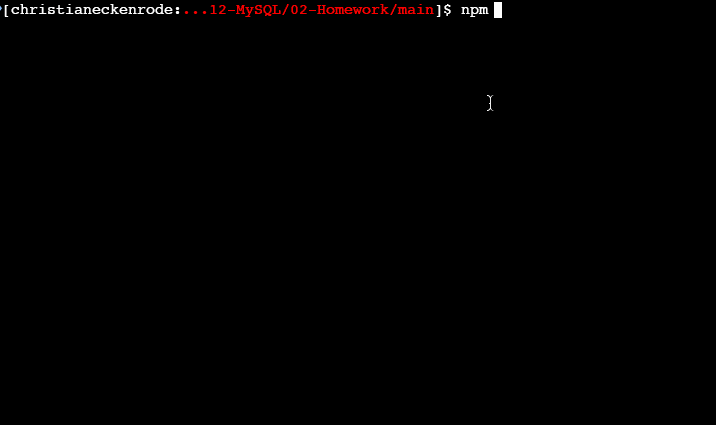

# video

# Employee-Tracker
An app that will be able to view and manage the departments, roles, and employees in the company , organize and plan the business.

# Criteria

GIVEN a command-line application that accepts user input
* WHEN I start the application
THEN I am presented with the following options: view all departments, view all roles, view all employees, add a department, add a role, add an employee, and update an employee role
* WHEN I choose to view all departments
THEN I am presented with a formatted table showing department names and department ids
* WHEN I choose to view all roles
THEN I am presented with the job title, role id, the department that role belongs to, and the salary for that role
* WHEN I choose to view all employees
THEN I am presented with a formatted table showing employee data, including employee ids, first names, last names, job titles, departments, salaries, and managers that the employees report to
* WHEN I choose to add a department
THEN I am prompted to enter the name of the department and that department is added to the database
* WHEN I choose to add a role
THEN I am prompted to enter the name, salary, and department for the role and that role is added to the database
* WHEN I choose to add an employee
THEN I am prompted to enter the employee’s first name, last name, role, and manager and that employee is added to the database
* WHEN I choose to update an employee role
THEN I am prompted to select an employee to update and their new role and this information is updated in the database 

# Bonus

Update employee managers.

View employees by manager.

View employees by department.

Delete departments, roles, and employees.

# What I used

1. Node.js
2. MySQL
3. NPM
4. ES6

## Installation

- Use the [MySQL]
- Use [InquirerJs]
- Use [console.table]

## Instructions

> Use console command [node index.js] or [npm start]  to run application in terminal.

# Screenshots:

## Features
- View Departments
- View Roles
- View Employees
- View Employees by Department
- View Employees by Manager
- Add Department
- Add Role
- Add Employee
- Update Employee Role
- Update Employee Manager
- Remove Employee
- Remove Department
- Remove Role

# Personal Notes
All the reqirements had been met, including the bonus, I put in order and try to providew a clean vervion so you can follow along.

Enjoy!